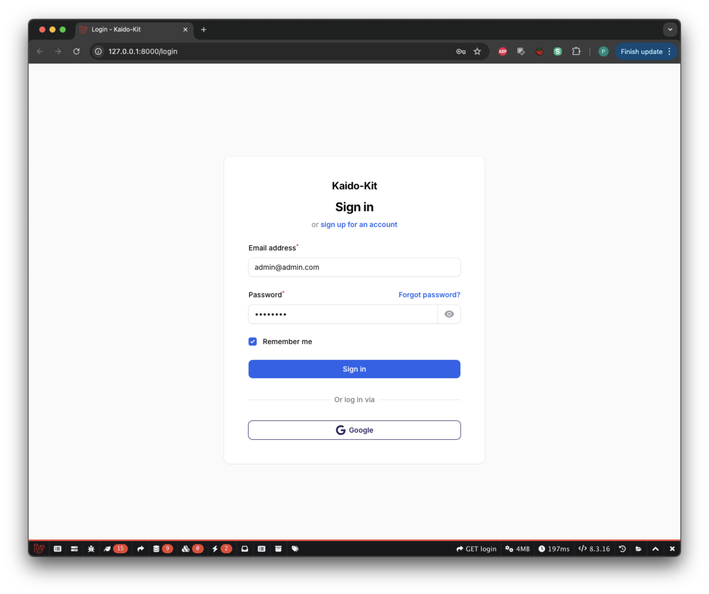
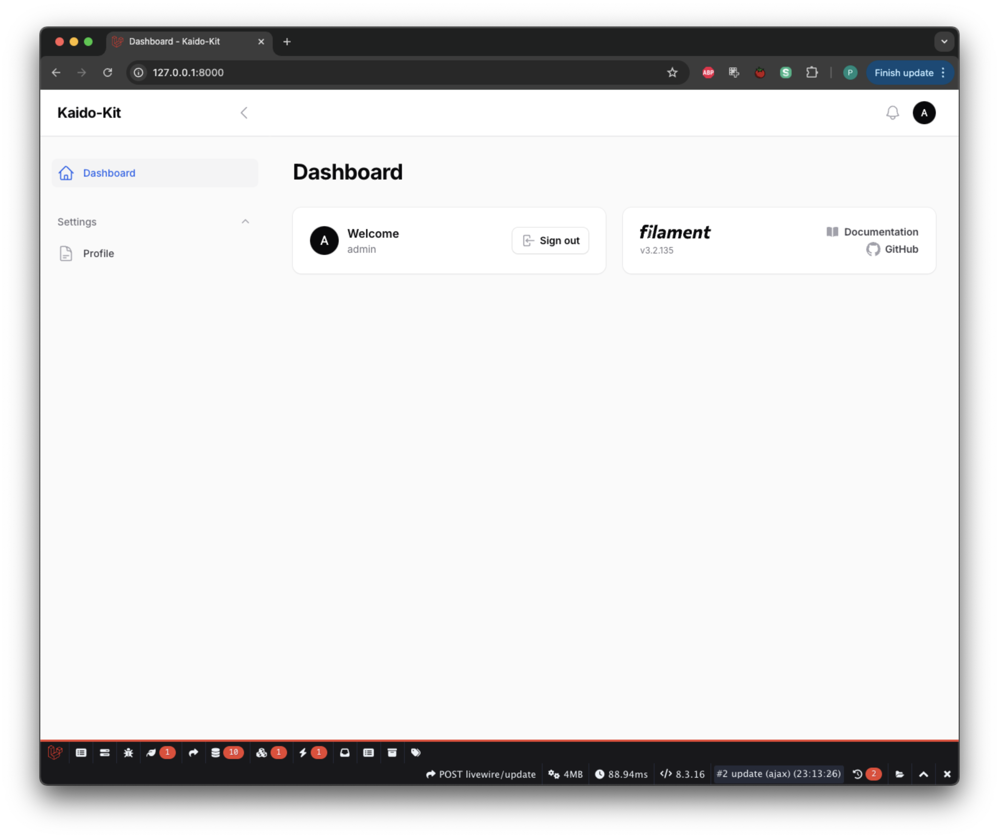
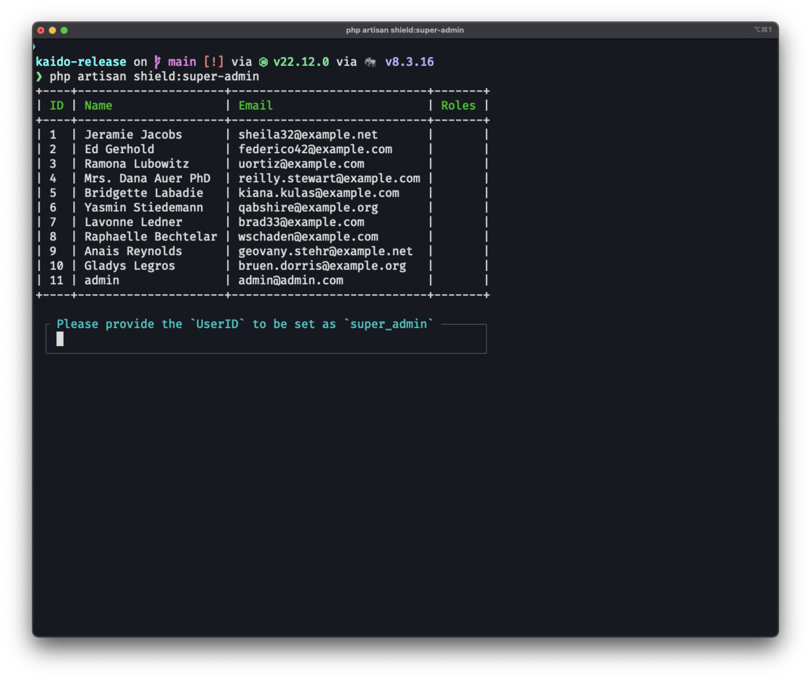
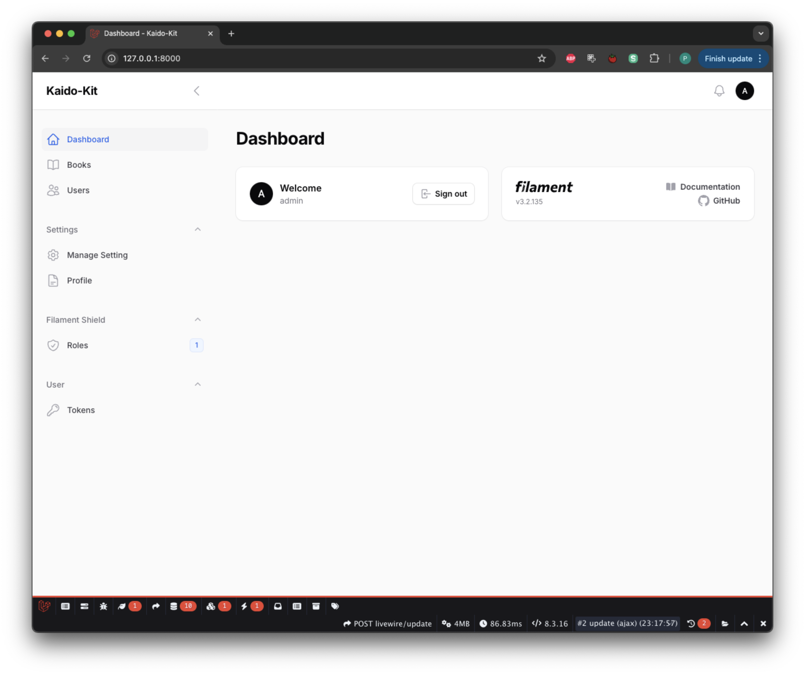

# 🚀 Kaido Kit FilamentPhp Starter Code

A powerful and opinionated FilamentPHP starter kit designed to accelerate your admin panel development. Kaido Kit provides a robust foundation with pre-configured plugins, configuration and best practices for building feature-rich admin interfaces.


## ✨ Features

### 🛠️ Developer Experience

- ⚡ Quick CRUD generation with customized [FilamentPHP](https://filamentphp.com/) stubs
    - Optimized UX out of the box
    - No need to modify generated resources
- 🔄 Auto reload on save for rapid development
- 📚 Easy API documentation using [Scramble](https://scramble.dedoc.co/)
- 📤 Built-in Export and Import examples in Filament resources

### 🔐 Authentication & Authorization

- 🛡️ Role-Based Access Control (RBAC) using [Filament Shield](https://filamentphp.com/plugins/bezhansalleh-shield)
- 🔑 Enhanced login page with custom design
- 🌐 Social login with Google via [Filament Socialite](https://filamentphp.com/plugins/dododedodonl-socialite)
- 👤 User profile management with [Filament Breezy](https://filamentphp.com/plugins/jeffgreco-breezy)
- 🔒 Instant 2-Factor Authentication capabilities
- 👥 Simple user-to-role assignment
- 🎭 User impersonation via [Filament Impersonate](https://filamentphp.com/plugins/joseph-szobody-impersonate)

### 📡 API & Integration

- 🚀 Full API support with [Filament API Service](https://filamentphp.com/plugins/rupadana-api-service)
    - Seamlessly integrated with Shield
    - Ready-to-use API endpoints
- 📨 Email integration using [Resend](https://resend.com/)
- 📝 Auto-generated API documentation

### 📁 Media & Content Management

- 🖼️ Integrated [Filament Media Library](https://filamentphp.com/plugins/filament-spatie-media-library)
    - Easy media handling process
    - [Spatie Media Library](https://spatie.be/docs/laravel-medialibrary) support

### ⚙️ Configuration & Settings

- 🎛️ Dynamic plugin management via [Filament Settings](https://filamentphp.com/plugins/filament-spatie-settings)
    - Enable/disable features on the fly
    - [Spatie Laravel Settings](https://github.com/spatie/laravel-settings) integration

## 🚀 Quick Start

1. Clone the repositories
    
    ```php
    git@github.com:siubie/kaido-kit.git
    ```
    
2. Composer install
    
    ```php
    composer install
    ```
    
3. Npm Install
    
    ```php
    npm install
    ```
    
4. Copy .env
    
    ```php
    cp .env.example .env
    ```
    
5. Configure your database in .env
    
    ```php
    DB_CONNECTION=mysql
    DB_HOST=127.0.0.1
    DB_PORT=3306
    DB_DATABASE=kaido_kit
    DB_USERNAME=root
    DB_PASSWORD=
    ```
    
6. Configure your google sign in cliend id and secret (optional)
    
    ```php
    #google auth
    GOOGLE_CLIENT_ID=
    GOOGLE_CLIENT_SECRET=
    GOOGLE_REDIRECT_URI=http://localhost:8000/admin/oauth/callback/google
    ```
    
7. Configure your resend for email sending (optional)
    
    ```php
    #resend
    MAIL_MAILER=resend
    MAIL_HOST=127.0.0.1
    MAIL_PORT=2525
    MAIL_USERNAME=null
    MAIL_PASSWORD=null
    MAIL_ENCRYPTION=null
    RESEND_API_KEY=
    MAIL_FROM_ADDRESS="admin@domain.com"
    MAIL_FROM_NAME="${APP_NAME}"
    ```
    
8. Migrate your database
    
    ```php
    php artisan migrate:fresh --seed
    ```
    
9. Artisan Serve
    
    ```php
    php artisan serve
    ```
    
10. Npm run dev
    
    ```php
    npm run dev
    ```
    
11. If run successfully you will get this login interface
    
    
    
12. When signed in it will show this (not much yet but it getting there :) )
    
    
    
13. Next step is to setup the RBAC, first generate the role and permission
    
    ```php
    php artisan shield:generate --all
    ```
    
14. It will ask which panel do you want to generate permission/policies for choose the admin panel.
15. Setup the super admin using this command
    
    ```php
    php artisan shield:super-admin
    ```
    
    
    
16. Choose your super admin user and login again.
    
    

## 🤝 Contributing

We welcome contributions! Please follow these steps:

1. Fork the repository
2. Create your feature branch (`git checkout -b feature/amazing-feature`)
3. Commit your changes (`git commit -m 'Add some amazing feature'`)
4. Push to the branch (`git push origin feature/amazing-feature`)
5. Open a Pull Request

## 🙏 Acknowledgments

- [FilamentPHP](https://filamentphp.com/)
- [Laravel](https://laravel.com/)
- All our amazing contributors

## 💬 Support

- 🐛 [Report a bug](https://github.com/siubie/kaido-kit/issues)
- 💡 [Request a feature](https://github.com/siubie/kaido-kit/issues)
- 📧 [Email support](mailto:putraprima@gmail.com)
- 💬 [Discord community](https://discord.com/invite/RwqXDUJGPg)
- 💬 [Whatsapp community](https://chat.whatsapp.com/HJtRp9Eo5wl6NhYIJbkuZL)

## ⭐ Show your support

Give a ⭐️ if this project helped you!
